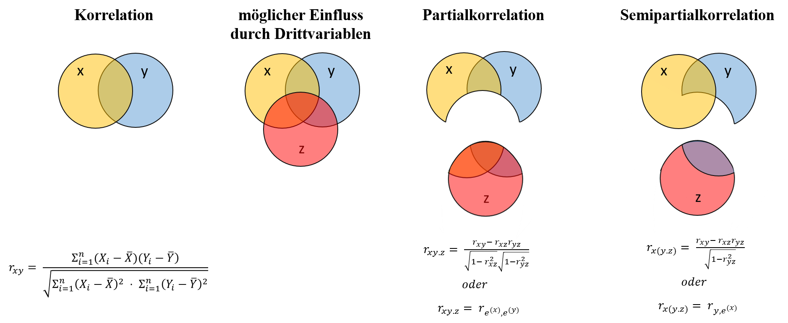

```{r include=FALSE}
#Pakete laden
library(learnr)
library(shiny)
library(ppcor)
library(ggplot2)
source('setup.R')
```

## Einleitung

Liebe Studierende,

sicher haben Sie in der Vorlesung bereits von der positiven Korrelation zwischen der Zahl der Störche und der Anzahl an Geburten gehört. Aber wussten Sie, dass auch der Konsum von Eiscreme und die Anzahl der Morde in New York oder die Anzahl von Nicolas-Cage-Filmauftritten mit der Anzahl weiblicher Redakteure beim Harvard Law Review positiv korreliert sind?^1^ Die Frage ist jedoch, ob mit den korrelativen Zusammenhängen der Beweis erbracht wurde, dass Störche Babys bringen, der Eiskonsum zu einer erhöhten Mordrate führt oder die Anzahl der Filme in denen Nicolas Cage mitspielt einen Effekt auf die Frauenquote bei der Harvard Law Review hat. Nein! Korrelationen liefern keine Belege für Kausalität. Zum einen gibt eine Korrelation keine Auskunft darüber, ob eine Variable *x* eine Variable *y* beeinflusst oder umgekehrt. Zum anderen kann der Zusammenhang zwischen zwei Variablen durch eine Drittvariable beeinflusst sein. So wird z.B. die Korrelation zwischen der Zahl der Störche und der Anzahl an Geburten durch die ländliche Region verursacht, da in ländlichen Regionen mehr Störche nisten und die Geburtenrate tendenziell höher ist als im städtischen Raum.
In der vierten Sitzung beschäftigen wir uns daher mit der Partial- und der Semipartialkorrelation, d.h. Methoden mit denen der Einfluss einer oder mehrerer Drittvariablen kontrolliert werden kann, um hierdurch Scheinkorrelationen, redundante oder maskierte Zusammenhänge aufzudecken.

Das folgende Video behandelt die Partial- und Semipartialkorrelation und demonstriert wie diese in R berechnet werden können.


*Anmerkungen:*

^1^ Es gibt einen ganzen Blog, der sich mit solchen Scheinkorrelationen (bzw. [`spurious Correlations`](http://tylervigen.com/spurious-correlations)) befasst.


## Wiederholung Korrelationen
In der Psychologie werden häufig statistische Zusammenhänge (bzw. stochastische Abhängigkeiten)  zwischen Variablen ermittelt. Der statistische Zusammenhang kann mithilfe verschiedener Zusammenhangsmaße gemessen werden, z.B. mit der bivariaten Produkt-Moment-Korrelation, die die Beziehung zwischen zwei metrischen Variablen (bzw. eine metrische und eine dichotome Variable) berechnet.

$r_{xy} = corr(X,Y) = \dfrac {\sum\limits_{i=1}^n (X_i - \bar{X})(Y_i - \bar{Y})}{\sqrt{\sum\limits_{i=1}^n (X_i - \bar{X})^2 \cdot \sum\limits_{i=1}^n (Y_i - \bar{Y})^2}}$

Der Korrelationskoeffizient r~xy~ misst die Stärke und Richtung einer linearen Beziehung zwischen zwei Variablen *x* und *y*. Der Wert von r~xy~ liegt dabei immer im Wertebereich zwischen +1 und -1. Eine Korrelation von 1 bedeutet ein perfekter positiver Zusammenhang, d.h. mit der Zunahme der eine Variablen, nimmt auch die anderen Variable zu und umgekehrt. Eine Korrelation von -1 bedeutet ein perfekter negativer Zusammenhang bei dem die Zunahme der einen Variablen mit der Abnahme der anderen Variablen einhergeht. Eine Korrelation von 0 hingegen bedeutet, dass es keinen Zusammenhang zwischen den Variablen gibt.     

{width="90%"}

Der Zusammenhang zwischen zwei Variablen *x* und *y* kann aber auch durch eine Drittvariable *z* beeinflusst werden. Methoden zur Kontrolle von Drittvariablen und zur Aufdeckung von Scheinkorrelationen, redundanten oder maskierten Zusammenhängen, sind die Partial- und Semipartialkorrelation.  

{width="50%"}


## Partialkorrelation

Die Partialkorrelation ist die bivariate Korrelation zweier Variablen *x* und *y*, die bestehen würde, wenn zuvor der Einfluss einer weiteren Variable *z* statistisch kontrolliert (d.h. "auspartialisiert" oder "herausgerechnet") wird. Die Partialkorrelation r~xy.z~ kann gebildet werden als Korrelation der Regressionsresiduen von (1) *x* bei Vorhersage durch *z* und (2) *y* bei Vorhersage durch *z*.  

{width="50%"}

**Beispiel: Testleistung**

Eine Stichprobe von 100 Schüler/-innen hat einen Lesetest (`reading`, *x*), einen Mathematiktest (`math`, *y*) und einen allgemeinen Intelligenztest (`IQ`, *z*) beantwortet.

```{r Korr_a, exercise = TRUE, echo=FALSE}

# Übersicht Datensatz und Korrelationen aller Variablen im Datensatz
str(Schulleistungen)
cor(Schulleistungen)

```

**1) Korrelation zwischen Lese- und Mathematikleistung**

```{r Korr_b, exercise = TRUE}
# 1a) grafische Darstellung mittels Scatterplot
ggplot(Schulleistungen, aes(x=reading, y=math)) + geom_point() + labs(x= "Leseleistung", y= "Mathematikleistung")

# 1b) Test der Korrelation zwischen Lese- und Mathematikleistung (r~xy~)
cor.test(Schulleistungen$reading, Schulleistungen$math)

```

**Interpretation der Ergebnisse:**

* der Korrelationskoeffiziert von .37 zeigt, dass die
  beiden fachspezifischen Tests für Lesen und Mathematik
  positiv miteinander korrelieren
* der p-Wert beträgt .000, ist also kleiner als .05 und zeigt somit, dass die
  Korrelation signifikant ist
  + bzw. die formal korrekte Interpretation: Der p-Wert beträgt .000, ist also kleiner als
    .05 , und somit signifikant auf einem Alpha-Fehlerniveau von 5 %. Das bedeutet, dass die
    Wahrscheinlichkeit, die Nullhypothese fälschlicherweise abzulehnen (bzw. den
    Alpha-Fehler zu begehen), geringer als 5 % ist.

**2) Regression zur Vorhersage von                                                               (a) der Leseleistung durch die allgemeine Intelligenz und                                   (b) der Mathematikleistung durch die allgemeine Intelligenz**

```{r Korr_c, exercise=TRUE}
# 2a) Regression zur Vorhersage der Leseleistung durch die allgemeine Intelligenz
reg.reading.IQ <- lm(reading ~ IQ, data = Schulleistungen)
summary(reg.reading.IQ)

# Residuen speichern (Residuen x)
res.reading.IQ <- reg.reading.IQ$residuals


# 2b) Regression zur Vorhersage der Mathematikleistung durch die allgemeine Intelligenz
reg.math.IQ <- lm(math ~ IQ, data = Schulleistungen)
summary(reg.math.IQ)

# Residuen speichern (Residuen y)
res.math.IQ <- reg.math.IQ$residuals

```

**3) Partialkorrelation (Korrelation zwischen den Residuen)**

```{r Korr_d, exercise = TRUE}
# 3a) Test der Korrelation zwischen den Residuen (r~xy.z~)
cor.test(res.reading.IQ, res.math.IQ)

```

Mit der Funktion pcor.test() lässt sich die Partialkorrelation direkt ermitteln:

```{r Korr_e, exercise = TRUE}
# 3b) Partialkorrelation, d.h. der Zusammenhang von Lese- und Mathematikleistung
# unter Kontrolle der allgemeinen Intelligenz (r~xy.z~)

   #Paket für die Partial- und Semipartialkorrelation laden
   #library(ppcor)

pcor.test(x=Schulleistungen$reading, y=Schulleistungen$math, z=Schulleistungen$IQ)
```

**Interpretation der Ergebnisse:**

* Regression zur Vorhersage der Leseleistung durch die allgemeine Intelligenz:
  + der Steigungsparameter (β~1~) beträgt 3.84, demzufolge steigt pro IQ-Punkt die
    Leseleistung um ca. 3.84 Punkte  
* Regression zur Vorhersage der Mathematikleistung durch die allgemeine Intelligenz:
  + der Steigungsparameter (β~1~) beträgt 5.71, demzufolge steigt pro IQ-Punkt die
    Mathematikleistung um ca. 5.71 Punkte

--> die allgemeine Intelligenz hat demzufolge einen Effekt auf die Lese- und
   Mathematikleistung

* Partialkorrelation:
  + der Korrelationskoeffizient (r~xy.z~) beträgt -.038, ist jedoch nicht
    signikikant (p=.712)
  + es zeigt sich also, dass der ursprüngliche Zusammenhang zwischen der Lese-
    und Mathematikleistung (*r~xy~*=.37) unter Kontrolle der allgemeinen Intelligenz verschwindet (Scheinkorrelation)

## Semipartialkorrelation

Wird aus inhaltlichen Gründen angenommen, dass die Drittvariable nur eine der Variablen *x* oder *y* beeinflusst, kann auf eine weitere Methode zur Aufdeckung von Scheinkorrelationen, redundanten oder maskierten Zusammenhängen zurückgegriffen werden; die Semipartialkorrelation. Bei dieser Methode wird der Einfluss der Drittvariablen nur aus einer der beiden Variablen herausgerechtet. Die Semipartialkorrelation r~x(y.z)~ entspricht der Korrelation zwischen x und dem Residuum von y bei Vorhersage durch z.

{width="50%"}

```{r Korr_f, exercise = TRUE}
# a Semipartialkorrelation von Lesen- und Mathematikleistung unter Kontrolle der
# allgemeinen Intelligenz auf die Mathematikleistung (Korrelation von x ('reading')
# mit dem Residuum y ('res.math.IQ'))
cor.test(Schulleistungen$reading, res.math.IQ)

```

Mit der Funktion spcor.test lässt sich die Semipartialkorrelation direkt ermitteln:

```{r Korr_g, exercise = TRUE}
# b Semipartialkorrelation von Lese- und Mathematikleistung unter Kontrolle der
# allgemeinen Intelligenz auf die Mathematikleistung
spcor.test(x=Schulleistungen$reading, y=Schulleistungen$math, z=Schulleistungen$IQ)

```

**Interpretation der Ergebnisse:**

* der Korrelationskoeffizient (r~x(y.z)~) beträgt -.031 ist jedoch nicht
  signifikant (p=.762)
* es zeigt sich also, dass der ursprüngliche Zusammenhang zwische Lese- und
  Mathematikleistung (*r~xy~*= .37) verschwindet, wenn der Einfluss der
  allgemeinen Intelligenz auf die Mathematikleistung kontrolliert wird
  (Scheinkorrelation)


## Zusammenfassung

{width="90%"}


## Aufgaben

Es ist ein regelmäßig replizierter Befund, dass Mädchen in Lesetests besser abschneiden als Jungen. Der Beispieldatensatz enthält Daten zur Lesekompetenz aus der deutschen Stichprobe der PISA-Erhebung in Deutschland 2009.
Enthalten sind die Variablen:

* Jahrgangsstufe (`grade`),
* Alter (`Age`)
* Geschlecht (`female`, 0=m / 1=w),
* Lesekompetenz (`Reading`),
* Fragebogen-Score für die Freude am Lesen (`JoyRead`) und
* Lernzeit in Minuten pro Woche für das Fach Deutsch (`LearnMins`)


1.) Bestimmen Sie den "Effekt" des weiblichen Geschlechts
    (`female`) auf die Lesekompetenz (`Reading`) und
    interpretieren sie das Ergebnis.

2.) Es ist unwahrscheinlich, dass sich der Besitz eines
    Y-Chromosoms direkt negativ auf die Lesekompetenz
    auswirkt. Daher soll untersucht werden, ob der
    Geschlechtsunterschied dadurch erklärt werden kann,
    dass Mädchen mehr für Deutsch lernen oder dass ihnen
    Lesen mehr Freude macht als Jungen.
    Untersuchen Sie zunächst die bivariaten Korrelationen
    von Lesekompetenz (`Reading`) und Geschlecht (`Female`)
    einerseits und den möglichen Einflussvariablen Lernzeit
    (`LearnMins`) und Freude am Lesen (`JoyRead`)
    andererseits.

a) Korrelation Lesekompetenz - Lernzeit
b) Korrelation Lesekompetenz - Freude am Lesen
c) Korrelation Geschlecht - Lernzeit
d) Korrelation Geschlecht - Freude am Lesen

Können Sie auf Basis dieser Zusammenhänge vermuten, ob
eine der beiden Drittvariablen für den
Geschlechtsunterschied relevant ist?


3.) Berechnen Sie die Partialkorrelationen zwischen
    Geschlecht und Lesekompetenz unter Kontrolle von

a) Lernzeit für Deutsch (`LearnMins`) und
b) Freude am Lesen (`JoyRead`)

4.) Gerichtete (kausale) Effekte der Lernzeit oder
    Lesefreude auf das Geschlecht werden nach derzeitigem
    Stand der Forschung für unwahrscheinlich gehalten. Es
    ist daher zwar sinnvoll, den Zusammenhang von Lernzeit
    und Lesefreude mit Lesekompetenz zu kontrollieren,
    nicht jedoch den Zusammenhang von Lernzeit und
    Lesefreude mit Geschlecht. Berechnen und interpretieren
    Sie daher den Zusammenhang zwischen Geschlecht und
    Lesekompetenz,

a) als Semipartialkorrelation, wobei Sie den Effekt von
   Lernzeit auf Lesekompetenz kontrollieren
b) als Semipartialkorrelation, wobei Sie den Effekt von
   Freude am Lesen auf Lesekompetenz kontrollieren    

5.) Berechnen Sie die Partialkorrelationen zwischen
   Geschlecht und Lesekompetenz unter Kontrolle von zwei
   Drittvariablen, der Lernzeit für Deutsch (`LearnMins`)
   und der Freude am Lesen (`JoyRead`).
