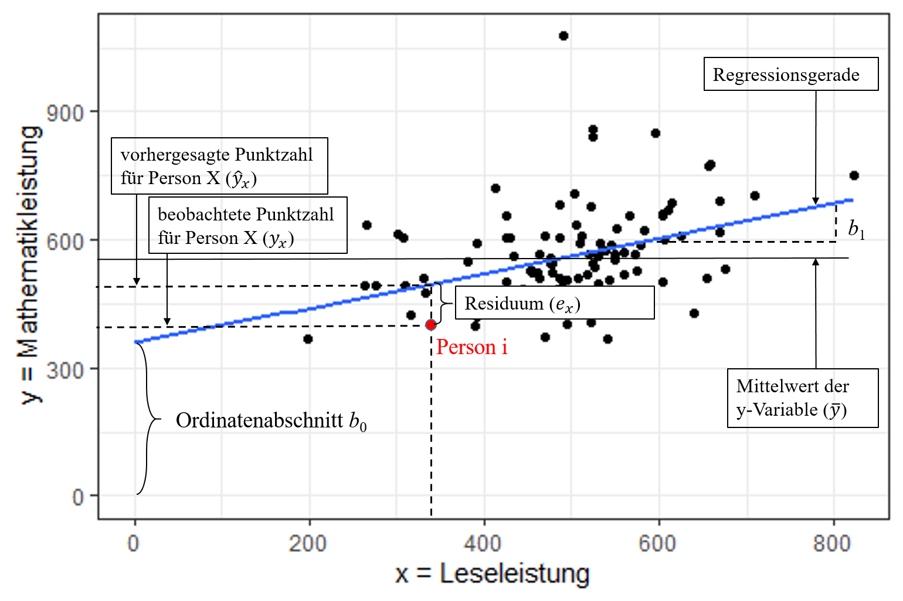
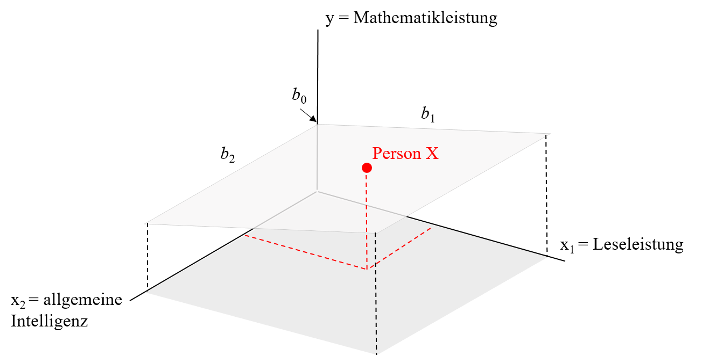

```{r include=FALSE}
#Pakete laden
library(learnr)
library(shiny)
source('setup.R')

```
## Einleitung

Liebe Studierenden,

in der letzten Sitzung haben wir unter anderem Korrelationen zwischen zwei Variablen behandelt. Zur Wiederholung: mithilfe einer Korrelation kann die Stärke des Zusammenhangs zwischen zwei Variablen quantifiziert werden. Dabei haben beide Variablen den gleichen Stellenwert, d.h. eigentlich ist es egal welche Variable die x- und welche Variable die y-Variable ist. Wir haben außerdem Methoden kennengelernt mit denen der Einfluss einer (oder mehrerer) Drittvariablen kontrolliert werden kann; die Partial- und Semipartialkorrelation. In der heutigen Sitzung wollen wir uns hingegen mit gerichteten Zusammenhängen, d.h. mit Regressionen, beschäftigen.

## Lineare Regression

Das Ziel einer Regression besteht darin, eine Variable durch eine oder mehrere andere Variablen vorherzusagen (Prognose und Erklärung). Die vorhergesagte Variable wird als Kriterium, Regressand oder auch abhängige Variable (AV) bezeichnet und üblicherweise mit y symbolisiert. Die Variablen zur Vorhersage der abhängigen Variablen werden als Prädiktoren, Regressoren oder unabhängige Variablen (UV) bezeichnet und üblicherweise mit x symbolisiert.
Die häufigste Form der Regressionsanalyse ist die lineare Regression, bei der der Zusammenhang über eine Gerade bzw. eine Ebene beschrieben wird. Demzufolge kann die lineare Beziehung zwischen den vorgesagten Werten und den Werten der unabhängigen Variablen mathematisch folgendermaßen beschreiben werden:

$$y_i = b_0 +b_{1}x_{i1} + ... +b_{m}x_{im} + e_i$$

* Ordinatenabschnitt/ y-Achsenabschnitt/ Konstante/ Interzept $b_0$:
    + Schnittpunkt der Regressionsgeraden
* Regressionsgewichte $b_{1}/ b_m$:
    + beziffern die Steigung der Regressionsgeraden
    + Interpretation: die Steigung der Geraden lässt erkennen, um wie viele Einheiten y zunimmt, wenn x um eine Einheit zunimmt
* Regressionsresiduum (kurz: Residuum), Residualwert oder Fehlerwert $e_m$
    + die Differenz zwischen einem vorhergesagten und beobachteten y-Wert ($\hat{y}-y$)
    + je größer die Fehlerwerte, umso größer ist die Abweichung eines beobachteten vom vorhergesagten Wert

{width="80%"}

$\hat{y_i} = b_0 +b_{1}x_{i1} + e_i$

{width="80%"}

$y_i = b_0 +b_{1}x_{i1} + b_{2}x_{i2} + e_i$


## Berechnung der Regressionsgewichte "per Hand"

Eine Stichprobe von 100 Schülerinnen und Schülern hat einen Lese- und einen Mathematiktest beantwortet, zusätzlich einen allgemeinen Intelligenztest. Die Testleistungen sind untereinander alle positiv korreliert. Auch die beiden fachspezifischen Tests für Lesen (`reading`) und Mathematik (`math`) korrelieren substanziell.

Oft wird argumentiert, dass zum Lösen von mathematischen Textaufgaben auch Lesekompetenz erforderlich ist. Anhand des Datensatzes soll untersucht werden, wie stark sich die Mathematikleistungen durch Lesekompetenz und allgemeine Intelligenz vorhersagen lassen.

Die Formel lautet demnach:

$$y_{i,math} = b_0 +b_{reading}x_{i,reading} + b_{IQ}x_{i,IQ} + e_i$$
oder in Matrixform:

$$\begin{align}
\begin{bmatrix} y_1\\y_2\\y_3\\y_4\\...\\y_{100}\end{bmatrix} = b_{0} *
\begin {bmatrix}1\\1\\1\\1\\...\\1\end{bmatrix} + b_{reading} *
\begin {bmatrix}x_{reading1}\\x_{reading2}\\x_{reading3}\\x_{reading4}\\...\\y_{reading100}\end{bmatrix} + b_{IQ} *
\begin {bmatrix}x_{IQ1}\\x_{IQ2}\\x_{IQ3}\\x_{IQ4}\\...\\x_{IQ100}\end{bmatrix} +
\begin {bmatrix}e_1\\e_2\\e_3\\e_4\\...\\e_{100}\end{bmatrix}
\end{align}$$


```{r Reg_a, echo=FALSE, exercise=TRUE}

# Vektor Y
y <- Schulleistungen$math
head(y)

# Matrix X vorbereiten (Spalten mit beiden Prädiktoren + Spalte mit Einsen anfügen)
X <- as.matrix(Schulleistungen[,c("reading", "IQ")])       
X <- cbind(rep(1,nrow(X)), X)                         
head(X)

```

\begin{align}y = \begin{bmatrix}451,98\\589,65\\509,33\\560,43\\...\\603,18\end{bmatrix}\end{align}

\begin{align}X = \begin{bmatrix}1 & 449,59 & 81,78\\1 & 544,85 & 106,76\\1 & 331,35 & 99,14\\1 & 531,54 & 111,91\\ ... & ... & ... \\1 & 487,22 & 106,13\end{bmatrix}\end{align}


**Vorgehen bei der Berechnung der Regressionsgewichte:**

1. Berechnung der Kreuzproduktsumme (X’X)
2. Berechnung der Inversen der Kreuzproduktsumme ($X'X^{-1}$)
3. Berechnung des Kreuzproduksummenvektors (X'y)
4. Berechnung des Einflussgewichtsvektor

**1. Berechnung der Kreuzproduktsumme (X’X)**

Die Kreuzproduktsumme (X'X) wird berechnet, indem die transponierte Matrix X (X') mit der Matrix X multipliziert wird. Die transponierte Matrix X' erhalten Sie durch die Befehl t(X).

\begin{align}
\dfrac{}{X'\begin{bmatrix} 1 & 1 & 1 & 1 & ... & 1\\449,58 & 544,85 & 331,35 & 531,54 & ... & 487,22\\81,78 & 106,76 & 99,14 & 111,91 & ... & 106,13\end{bmatrix}}
\dfrac{\begin{bmatrix}1 & 449,59 & 81,78\\1 & 544,85 & 106,76\\1 & 331,35 & 99,14\\1 & 531,54 & 111,91\\... & ... & ... \\1 & 487,22 & 106,13\end{bmatrix}X}
{\begin{bmatrix}100,00 & 49606,60 & 9813,43\\49606,61 & 25730126,10 & 4962448,08\\9813,43 & 4962448,10 & 987595,82\end{bmatrix}X'X}\end{align}


```{r Reg_b, exercise = TRUE, echo=FALSE}

# Berechnung der der Kreuzproduktsumme X’X in R
X.X <- t(X) %*% X        # X' erhalten Sie durch t(X)
X.X

```

**2. Berechnung der Inversen der Kreuzproduktsumme $(X'X^{-1})$**

Die Inverse der Kreuzproduktsumme kann in R durch den solve-Befehl berechnet werden.

```{r Reg_c, exercise = TRUE, echo=FALSE}

# Berechnung der Inversen (mit Regel nach Sarrus) in R
solve(X.X)

```

\begin{align}(X'X)^{-1}= \begin{bmatrix}0,42 & -1,56e^{-04} & -3,39^{-03}\\-0,00 & 1,32e^{-06} & -5,06e^{-06}\\-0,00 & -5,06e^{-06} & 6,01e^{-05}\end{bmatrix}\end{align}

**3. Berechnung des Kreuzproduksummenvektors (X'y)**

Der Kreuzproduktsummenvektor (X'y) wird durch die Multiplikation der transponierten X Matrix (X') und des Vektors y berechnet.  


\begin{align}
\dfrac{}{X'\begin{bmatrix}1 & 1 & 1 & 1 & ... & 1\\449,58 & 544,85 & 331,35 & 531,54 & ... & 487,22\\81,78 & 106,76 & 99,14 & 111,91 & ... & 106,13\end{bmatrix}}
\dfrac{\begin{bmatrix}451,98\\589,65\\509,33\\560,43\\...\\603,18\end{bmatrix}y}
{\begin{bmatrix}56146,45\\28313059,77\\5636931,00\end{bmatrix}X'y}
\end{align}

```{r Reg_d, exercise = TRUE, echo=FALSE}

#Berechnung des Kreuzproduksummenvektors X`y in R
X.y <- t(X) %*% y        
X.y

```

**4. Berechnung des Einflussgewichtsvektors**

Die geschätzten Regressionsgewichte nach dem Kriterium der kleinsten Quadrate werden berechnet, indem die Inverse der Kreuzproduktsumme $(X'X^{-1})$ mit dem  Kreuzproduksummenvektor (X'y) multipliziert wird. Den Vektor mit den vorhergesagten Werte von y ($\hat{y}$) können Sie durch die Multiplikation der X Matrix mit den Regressionsgewichten ($\hat{b}$) berechnen.  

\begin{align}
\dfrac{}{(X'X)^{-1}\begin{bmatrix}0,42 & -1,56e^{-04} & -3,39^{-03}\\-0,00 & 1,32e^{-06} & -5,06e^{-06}\\-0,00 & -5,06e^{-06} & 6,01e^{-05}\end{bmatrix}}
\dfrac{\begin{bmatrix}56146,45\\28313059,77\\5636931,00\end{bmatrix}X'y}
{\begin{bmatrix}58,17\\-0,04\\5,31\end{bmatrix}\hat{b}}
\end{align}


```{r Reg_e, exercise = TRUE, echo=FALSE}

# Berechnung des Einflussgewichtsvektor in R
b.hat <- solve(X.X) %*% X.y     # Vektor der geschätzten Regressionsgewichte
b.hat

y.hat <- as.vector(X %*% b.hat) # Vorhersagewerte
head(y.hat)

```
\begin{align}
\hat{y}_{math} = \begin{bmatrix}476,29\\605,51\\572,71\\633,37\\...\\604,22\end{bmatrix}
\end{align}

**Berechnung der standardisierten Regressionsgewichte**

Bisher wurden aber nur die *unstandardisierten Regressionsgewichte* berechnet. Diese haben den Vorteil leicher interpretierbar zu sein. So wird das unstandardisierte Regressionsgewicht folgendermaßen interpretiert: wenn sich die unabhängige Variable um eine Einheit verändert, verändert sich die abhängige Variable um den unstandardisierten Koeffizienten. Der Nachteil dieser unstandardisierten Regressionsgewichte ist jedoch, dass die Regressionsgewichte nicht vergleichbar sind. Demzufolge kann anhand der Größe der Regressionsgewichte nicht gesagt werden, welcher Regressionskoeffizient eine stärkere Erklärungskraft hat.
Daher werden die Regressionsgewichte häufig standardisiert. Durch die Standardisierung sind die Regressionsgewichte nicht mehr von der ursprünglichen Skala abhängig und haben daher den Vorteil, dass sie miteinander verglichen werden können. Allerdings sind die *standardisierten Regressionsgewichte* nicht mehr so leicht zu interpretieren. Die Interpretation der standardisierten Regressionsgewichte lautet: wenn sich die unabhängige Variable um eine Standardabweichung erhöht (und unter Kontrolle weiterer unabhängiger Variablen), so beträgt die erwartete Veränderung in der abhängigen Variable $\beta$ Standardabweichungen (das standardisierte Interzept ist Null).
Die standardisierten Regressionsgewichte können über den standardisierten y Vektor und die standardisierte Matrix (dazu scale-Befehl in R) ermittelt werden.   

```{r Reg_g, echo=FALSE, exercise=TRUE}

#Berechnung der standardisierten Regressionsgewichte
y.s <- scale(y) # Standardisierung y
X.s <- scale(X) # Standardisierung X
X.s[,1] <- 1    # Einsenvektor ist nach Standardisierung zunächst NaN, muss wieder gefüllt werden

b.hat.s <- solve(t(X.s)%*% X.s) %*% t(X.s)%*%y.s #Regressionsgewichte aus den standardisierten Variablen
round(b.hat.s, 3)

```


**Berechnung des globaler Signifikanztest**

*Determinationskoeffizient $R^2$*

Der Determinationskoeffizient $R^2$ gibt an wieviel Varianz in der abhängigen Variable durch die unabhängigen Variablen erklärt werden kann:

$R^2= \dfrac{Q_d}{Q_d + Q_e}$

```{r Reg_h, exercise = TRUE, echo=FALSE}

# Determinationskoeffizient R2
Q.d <- sum((y.hat - mean(y))^2)    # Regressionsquadratsumme
Q.e <- sum((y - y.hat)^2)          # Fehlerquadratsumme
R2 <- Q.d / (Q.d + Q.e)            # Determinationskoeffizient R2

```

$R^2= \dfrac{Q_d}{Q_d + Q_e} = \dfrac{`r round (Q.d,2)`}{`r round (Q.d,2)` + `r round (Q.e,2)`} = `r round (R2,2)`$


*F-Wert*

Der F-Wert dient zur Überprüfung der Gesamtsignifikanz des Modells.


```{r Reg_i, exercise = TRUE, echo=FALSE}

# F-Wert
n <- length(y)                     # Fallzahl (n=100)
m <- ncol(X)-1                     # Zahl der Prädiktoren (m=2)
F.omn <- (R2/m) / ((1-R2)/(n-m-1))   # F-Wert
F.krit <- qf(.95, df1=m, df2=n-m-1)  # kritischer F-Wert (alpha=5%)
p <- 1-pf(F.omn, m, n-m-1)           # p-Wert

```


$F_{omn} = \dfrac{\dfrac{R^2}{m}}{\dfrac{1-R^2}{n-m-1}} = \dfrac{\dfrac{`r round(R2,2)`}{`r m`}}{\dfrac{1-`r round(R2,2)`}{`r n`-`r m`-1}} = `r round(F.omn,2)`$

$df_1 = 2, df_1 = n-m-1 = `r n`-`r m`-1 =97$

$F_{krit}(\alpha=.05, df_1=2, df_2= 97)= `r round (F.krit,2)`$

$p=`r sprintf(format(p, digits = 3, trim = TRUE, scientific = FALSE))`$


## Berechnung der Regression mit lm-Funktionen in R

Für die Schätzung von Regressionsmodellen kann die Basis-Funktion `lm` verwendet werden. Um zusätzlich die standardisierten Koeffizienten zu erhalten, kann die Funktion `lm.beta` aus dem gleichnamigen Paket `lm.beta` genutzt werden.

```{r Reg_j, exercise = TRUE, echo=FALSE}

#Paket installieren (wenn nötig)
#install.packages("lm.beta", repos = "http://cran.us.r-project.org")
library(lm.beta)

# Regressionsanalyse mit lm
reg <- lm(math ~ reading + IQ, data = Schulleistungen)

# Ergebnisausgabe einschließlich standardisierter Koeffizienten mit lm.beta
summary(lm.beta(reg))

```

**Ergebnisinterpretation:**

* die Lesekompetenz und allgemeine Intelligenz erklären gemeinsam 48,73% der Varianz in der Mathematiktestleistung
* Dieser Varianzanteil ist signifikant von null verschieden
* Regressionsgewichte:
    + Regressionskonstante $b_0$:
        + Der Erwartungswert der Mathematikleistung für ein Individuum mit null Punkten im IQ und null Punkten in Lesekompetenz beträgt 58,17 Punkte.
    + Regressionsgewicht $b_1$:
        + bei einem Punkt mehr in der Lesekompetenz und unter Kontrolle des IQ beträgt die erwartete Veränderung in der Mathematikleistung `r round(b.hat[2],2)` Punkte.
        + Der Einfluss von Lesekompetenz auf Mathematikleistung ist nicht signfikant von null verschieden ($p=`r round(summary(reg)$coefficients[,4][2], 3)`$)
    + Regressionsgewicht $b_2$:
        + unter Kontrolle der Lesekompetenz beträgt die erwartete Veränderung in der Mathematikleistung bei einem Punkt mehr im IQ `r round(b.hat[3],2)` Punkte.
        + Der Einfluss der allgemeinen Intelligenz auf Mathematikleistung ist signfikant von null verschieden ($p=`r round(summary(reg)$coefficients[,4][3], 3)`$)    

* Standardisierte Regressionsgewichte
    + Standardisiertes Regressionsgewicht $\beta_1$: Unter Kontrolle des IQ beträgt die erwartete Veränderung in der Mathematikleistung bei einer Standardabweichung mehr in Lesekompetenz `r round(b.hat[2],2)` Standardabweichungen.
    + Standardisiertes Regressionsgewicht $\beta_2$: Unter Kontrolle der Lesekompetenz beträgt die erwartete Veränderung in der Mathematikleistung bei einer Standardabweichung mehr im IQ `r round(b.hat[3],2)` Standardabweichungen.


## Aufgaben

1. Berechnen Sie mit einer Einfachregression den Einfluss des Geschlechts auf die Lesekompetenz und interpretieren Sie die Regressionskoeffizienten und die standardisierten Regressionsgewichte.
2. Untersuchen Sie mit einer multiplen Regression den gemeinsamen Einfluss von Lesefreude (`JoyRead`) und Lernzeit (`LearnMins`) auf die Lesekompetenz und interpretieren Sie die Ergebnisse einschließlich der standardisierten Regressionsgewichte.
3. Untersuchen Sie mit einer multiplen Regression den gemeinsamen Einfluss von Geschlecht (`Female`), Lesefreude (`JoyRead`) und Lernzeit (`LearnMins`) auf die Lesekompetenz und interpretieren Sie die Ergebnisse einschließlich der standardisierten Regressionsgewichte.
